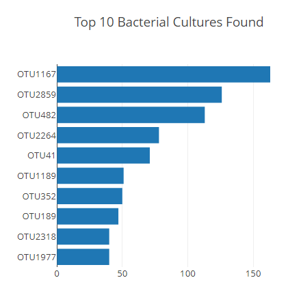
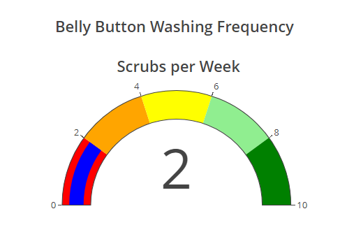

# Belly Button Biodiversity Dashboard with Plotly.js

<div align="center">
    
</div>

## <div align="center">Build Interactive Web Dashboard for Exploring Belly Button Biodiversity Data using Plotly.js, Javascript and D3.js</div>

<p align="center">
<a href="#goals">Goals</a> &nbsp;&bull;&nbsp;
<a href="#dataset">Dataset</a> &nbsp;&bull;&nbsp;
<a href="#tools-used">Tools Used</a> &nbsp;&bull;&nbsp;
<a href="#analysis-and-challenges">Analysis and Challenges</a> &nbsp;&bull;&nbsp;
<a href="#results">Results</a>
</p>

# <div align="center">Goals</div>

Utilize JavaScript, Plotly, and D3.js to build the following visualizations:

- horizontal bar chart to display the top 10 bacterial species (OTUs) when an individual’s ID is selected from the dropdown menu on the webpage
- bubble chart that will display the following when an individual’s ID is selected from the dropdown menu webpage
- gauge chart that displays the weekly washing frequency's value, and display the value as a measure from 0-10 on the progress bar in the gauge chart when an individual ID is selected from the dropdown menu

# <div align="center">Dataset</div>

- [Belly Button Data:](samples.json) JSON file containing belly button biodiversity data

# <div align="center">Tools Used</div>
- **Javascript:** Programming language used for creating visually appealing and dynamic web content
    - **Plotly.js:** Javascript library used to create engaging and dynamic charts
    - **D3.js:** Javascript library used for data visualization, reading JSON files and placing API calls    
- **HTML:** Hypertext Markup Language used to build and design webpages
- **CSS:** Creative Style Sheets add dynamic visual styling to html webpages


# <div align="center">Analysis and Challenges</div>
 
 Using Javascript, we built a javascript function in our charts.js file that compiled data from samples.json, and through the following plotly CDN generated the descriptive charts below:

```
<script src="https://cdn.plot.ly/plotly-latest.min.js"></script>
```






[Back to top](#belly-button-biodiversity-dashboard-with-plotly.js)
